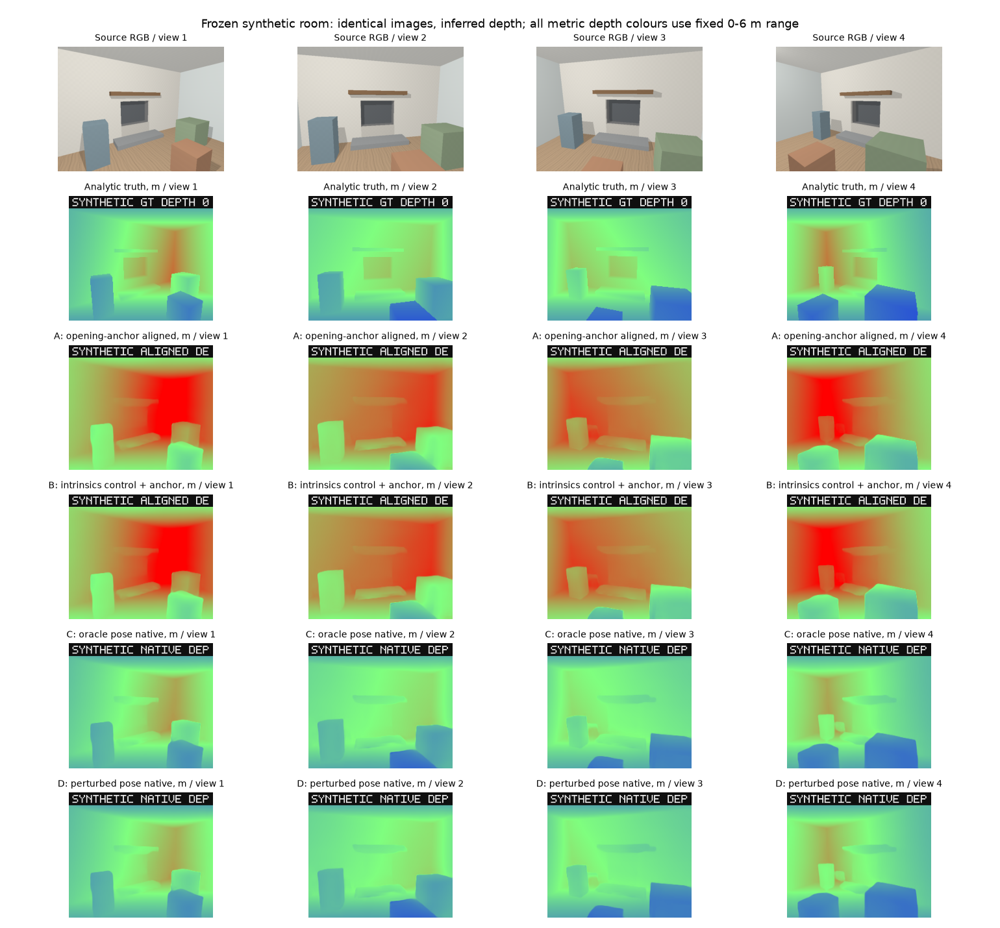
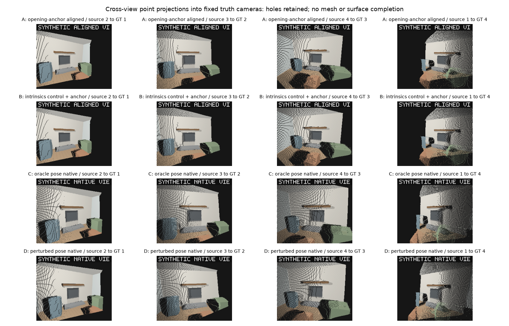

# DA3 Small camera-conditioning experiment v1

October 4, 2026. **Outcome 2: partial improvement. A major practical camera solver is not justified yet.** Correct camera information makes DA3 Small's global metric depth much better, but held-out object geometry remains too inaccurate for direct reconstruction. Compare one alternate commercially acceptable lightweight observed-geometry model on this exact frozen fixture before investing in camera solving.

This is a local synthetic experimental milestone, not client integration. No paid API/cloud GPU, client change, production mesh, materials, semantic recognition, camera solver integration, worker latency optimization or authoritative geometry was added.

## Repository and immutable baseline

Verified `C:\Projects\image-blaster`, clean initial working tree, branch `codex/provider-neutral-foundation`, starting HEAD `18aae76187593236f589b5cacda7a7d1439c26c4`. Origin is `https://github.com/DrewYomantas/image-blaster.git`; upstream remains `https://github.com/neilsonnn/image-blaster.git`. Main, TPS and Benson Hearth Studio were not touched. The active authenticated push account is DrewYomantas.

Lane A is the original committed [unconditioned receipt](geometry-results/da3-small-cpu-v1.json), SHA-256 `b761cf159054938bdfd21efac6a6a174eef06fd9cc7dcb7a218c7d0dfd4fcedf`. Its NPZ SHA-256 is `22e5ea9dccdc8890c94dce85e9172045bd11e1cce7f9cf7fa0b5b74c98e4526d`. Neither was replaced or rerun. Supplemental evaluations read the original NPZ. The runner asserts exact equality of all existing depth/boundary/dimension/camera/focal/anchor/alignment metrics against the original receipt.

The unchanged `fixture.py` regenerated into a separate ignored directory. All four PNGs match the baseline byte-for-byte:

| Image | SHA-256 |
| --- | --- |
| view-01.png | `a2a6946feb12b3daed1c4b2051f6d402270463dee76c6f0e505116c8408ca8a7` |
| view-02.png | `0a322ec9f025870bbc4bdc9062fb48dd38a33437a0ba135570a5d23f80b06848` |
| view-03.png | `daa36b9ab1f6ec90107cf922c916c55bbc9bfc189b1333d5399f7c2ca78c75ae` |
| view-04.png | `251de8b6da00c3fd4d4d4748912719b2eb14c22affc621f24db41c8b50bcaae7` |

Regenerated metadata differs at less than `5e-16` in floating-point extrinsics/anchor pixels between installed Python runtimes. Original canonical truth bytes are retained for evaluation and conditioning: SHA-256 `e7958de3ee28d1bb15049011c24bb7f5755d547456761d66f5573cbf7c7a7bf8`. No camera was moved, fixture tuned, or geometry/texture/light/resolution/evaluation rule changed.

## Exact upstream semantics

DA3 revision remains `3d835ec1a5802d64a8b8b15f817a1ab54809bfe4`; model revision remains `e08cab65ca0ec38e7826075418411ab90cab4da3`. Weights/config hashes remain the reviewed `364492e3…` / `a486e29e…`, validated in every identity receipt. Adapter is `da3-small-cpu-4`, CPU float32, six threads, requested resolution256. Full immutable hashes, installed packages and upstream-source digest are in each worker receipt.

Inspection used the actual installed pinned source, with source blobs checked against its Git tree. Primary upstream references: [API](https://github.com/ByteDance-Seed/Depth-Anything-3/blob/3d835ec1a5802d64a8b8b15f817a1ab54809bfe4/src/depth_anything_3/api.py), [model](https://github.com/ByteDance-Seed/Depth-Anything-3/blob/3d835ec1a5802d64a8b8b15f817a1ab54809bfe4/src/depth_anything_3/model/da3.py), [InputProcessor](https://github.com/ByteDance-Seed/Depth-Anything-3/blob/3d835ec1a5802d64a8b8b15f817a1ab54809bfe4/src/depth_anything_3/utils/io/input_processor.py), [pose alignment](https://github.com/ByteDance-Seed/Depth-Anything-3/blob/3d835ec1a5802d64a8b8b15f817a1ab54809bfe4/src/depth_anything_3/utils/pose_align.py).

- The camera encoder is called only when extrinsics are supplied. It inverts world-to-camera poses and encodes camera translation/quaternion and focal-derived horizontal/vertical FOV. Principal points do not enter those camera tokens. Intrinsics-only does not condition the backbone.
- The official InputProcessor resizes RGB and supplied K, preserving ordered input correspondence. With pose tokens, the backbone disables automatic reference-view reordering and uses source0. A/B choose saddle-balanced reference and restore outputs to original order.
- The API makes supplied poses relative to camera0, then divides translations by the clamped Torch median camera-centre distance (minimum0.1). This removes metric input scale from the forward tokens.
- The camera decoder still predicts K/E. The official pose alignment helper uses decoded cameras as reference and supplied cameras as estimate, computes Umeyama similarity, replaces output K/E with processed supplied K/original supplied metric E, and divides predicted depth by the returned scale. Four views do not trigger RANSAC. This is metric scale injection from supplied cameras after depth inference.

The worker retains official network/InputProcessor/OutputProcessor and actual official `align_poses_umeyama`. Its CPU normalization mirrors API math and is regression-compared to the pinned method. Exporter-heavy API imports and GPU autocast remain outside the existing CPU compatibility boundary. No revision was switched. Raw decoder depths/K/E are preserved separately in every new NPZ.

Observed improvement belongs to the entire supported supplied-camera path, including conditioning, changed reference ordering, metric scale injection and supplied camera replacement. This experiment does not isolate the camera encoder's causal effect.

## Explicit request and provenance contract

Separate `request.conditioning` accepts absent/`none`, `intrinsics-only`, or `pose`. Camera-bearing modes require `provenance: experiment-oracle` and `cameraConvention: opencv-world-to-camera-scene-y-up-meters`. K is N×3×3; pose E is N×4×4 with homogeneous final row, proper rotations and noncollinear camera centres. Count/shape/finite values/positive focal/zero-skew/convention are validated before cache dispatch and independently by the worker. Production requests still default to images only; no directory convention finds benchmark truth.

[Conditioning declaration](geometry-results/camera-conditioning-v1/conditioning-declaration.json) and explicit B/C/D camera files were derived only from original camera truth. No ground-truth depth, labels, object sizes or 1.20m anchor entered inference. Camera file hashes are checked before each request. Source image bytes and worker hashes are also checked.

Lane B is an experiment-only negative control, not a promoted production feature. [Exact tensor comparison](geometry-results/camera-conditioning-v1/intrinsics-negative-control-v1.json) proves bit-identical depth, confidence, K and E to A, maximum difference0. NPZ file hashes differ because new metadata/raw arrays were added.

SceneSpec remains v1. Oracle input is a `user-input` source, never field-measurement/manufacturer/registered geometry. Supplied output pose/projection facts are `user-specified` with explicit oracle notes. Depth is inferred; conditioned decoder cameras are retained but marked non-independent. Metre pose scale is `supplied-camera`, distinct from `anchored` and ambiguous relative evidence. Every artifact remains visual-only; Benson technical export still fails closed and installationApproved stays false.

## Intrinsics and preprocessing proof

Source K is fx=fy350, cx319.5, cy239.5 at640×480. Official two-stage resize produces252×196 without crop/pad. Actual float32 processed K in Lane C is fx137.8125, fy142.91667175, cx125.80312347, cy97.79583740. Regression tests execute the actual pinned InputProcessor at256 and384 without model inference.

**Image sampling and K transformation are different upstream conventions.** `camera.pixelTransform` / SceneSpec `inputPixelTransform` describes RGB sampling: `(x+0.5)*sx-0.5`. Supplied K uses upstream whole-row scaling with no half-pixel offset. Applying the RGB transform directly to K would yield the frozen evaluator's cx125.5, cy97.5 instead. The difference is +0.30312/+0.29584 pixels. Both processed K and frozen evaluation K/delta are recorded. Neither is silently corrected; the exact original analytic re-raycast evaluation remains frozen.

## Lane matrix and scale sources

| Lane | Scale path | SILog RMSE | AbsRel | RMSE m | Opening P | Opening R | Opening F1 | Reprojection px | Scatter cm |
| --- | --- | --- | --- | --- | --- | --- | --- | --- | --- |
| A | ALIGNED | 0.07156 | 0.553 | 1.472 | 0.674 | 0.255 | 0.370 | 24.88 | 20.49 |
| B | ALIGNED | 0.07156 | 0.553 | 1.472 | 0.674 | 0.255 | 0.370 | 24.88 | 20.49 |
| C | NATIVE | 0.07023 | 0.051 | 0.181 | 0.765 | 0.175 | 0.285 | 5.66 | 19.60 |
| D | NATIVE | 0.07234 | 0.057 | 0.208 | 0.774 | 0.187 | 0.301 | 9.12 | 21.11 |
| C | ALIGNED | 0.07023 | 0.169 | 0.435 | 0.762 | 0.203 | 0.321 | 10.07 | 22.88 |
| D | ALIGNED | 0.07234 | 0.220 | 0.571 | 0.759 | 0.214 | 0.334 | 10.35 | 26.22 |

A/B raw relative AbsRel0.67211 and numeric RMSE1.92304 versus metre truth are gauge diagnostics, not physical accuracy. A/B ALIGNED receive metric scale only from the existing1.20m post-inference anchor. C/D NATIVE receive metric scale only from DA3's supplied-camera path, with no benchmark anchor or rigid fit. C/D ALIGNED receive both scale injections and the original fixed-anchor/rigid evaluation, shown separately.

Lane C's official depth multiplier is 3.107615; its later anchor multiplier is 1.166966. The anchor worsens RMSE from0.181 to0.435m. Lane D's corresponding multipliers are 3.042544 and 1.242146; anchor RMSE worsens from0.208 to0.571m. No original array was overwritten.

Native C improves RMSE87.7% and AbsRel90.7% versus anchored A; matching the original anchor path still improves RMSE70.4% and AbsRel69.5%. These are explicit comparisons across the named scale paths. SILog only improves1.9%, showing very limited improvement in relative depth shape. Oracle output cameras are inputs, so zero native camera error is not an independent model achievement.

## Held-out dimensions

Native C and D use supplied scene frame directly; D pose errors are not fitted away. Estimates remain untrimmed observed point bounds grouped with fixed evaluation-only labels. No confidence tuning, outlier removal, hidden completion or semantic inference was added. All predicted visible samples are valid. Original anchor-path dimensions and all visibility metadata also remain in v2 receipts.

| Entity | Axis | Target m | C observed m | C error cm | C error % | D error cm | GT coverage | Claim |
| --- | --- | --- | --- | --- | --- | --- | --- | --- |
| room | width | 4.800 | 5.101 | 30.1 | 6.3 | 3.9 | 100.0% | full axis |
| room | height | 2.700 | 3.091 | 39.1 | 14.5 | 24.6 | 100.0% | full axis |
| room | depth | 2.497 | 2.718 | 22.1 | 8.8 | 11.9 | 69.4% | visible span only |
| opening-back | height | 0.900 | 0.781 | 11.9 | 13.2 | 2.3 | 98.6% | full axis |
| opening-recess | height | 0.900 | 0.849 | 5.1 | 5.7 | 4.8 | 98.8% | full axis |
| opening-recess | depth | 0.250 | 0.240 | 1.0 | 4.0 | 1.5 | 71.4% | visible span only |
| hearth | width | 1.800 | 2.227 | 42.7 | 23.7 | 41.1 | 100.0% | full axis |
| hearth | height | 0.140 | 0.400 | 26.0 | 185.6 | 37.4 | 100.0% | full axis |
| hearth | depth | 0.550 | 0.791 | 24.1 | 43.8 | 16.8 | 100.0% | full axis |
| mantel | width | 1.900 | 1.959 | 5.9 | 3.1 | 2.4 | 100.0% | full axis |
| mantel | height | 0.120 | 0.149 | 2.9 | 24.4 | 16.1 | 100.0% | full axis |
| mantel | depth | 0.240 | 0.553 | 31.3 | 130.4 | 34.5 | 99.2% | full axis |
| tall-left-box | width | 0.480 | 1.342 | 86.2 | 179.7 | 63.5 | 100.0% | full axis |
| tall-left-box | height | 1.000 | 1.191 | 19.1 | 19.1 | 22.2 | 100.0% | full axis |
| tall-left-box | depth | 0.420 | 1.127 | 70.7 | 168.4 | 64.0 | 99.9% | full axis |
| foreground-stool | width | 0.520 | 2.534 | 201.4 | 387.4 | 189.0 | 100.0% | full axis |
| foreground-stool | height | 0.600 | 0.789 | 18.9 | 31.5 | 16.0 | 99.0% | full axis |
| foreground-stool | depth | 0.520 | 1.589 | 106.9 | 205.6 | 97.3 | 100.0% | full axis |
| right-seat-box | width | 0.760 | 2.146 | 138.6 | 182.3 | 135.9 | 100.0% | full axis |
| right-seat-box | height | 0.800 | 1.063 | 26.3 | 32.8 | 16.9 | 100.0% | full axis |
| right-seat-box | depth | 0.660 | 1.754 | 109.4 | 165.7 | 106.2 | 100.0% | full axis |

The opening-back height and union recess height are separate original estimators. Both opening widths are excluded as calibration dimensions. Room depth and recess depth target only the observed truth spans (69.4% and71.4% coverage); full hidden depth is unverified. Zero-thickness opening-back depth is a planarity diagnostic, not held-out dimensional success: C inferred thickness22.97cm, D23.14cm, with no percentage error. v2 corrects this numeric-zero labeling and the native original-extent metre label; initial v1 receipts are retained as historical evidence.

## Cross-view consistency

| Entity | A anchor cm | B anchor cm | C native cm | D native cm |
| --- | --- | --- | --- | --- |
| room | 20.39 | 20.39 | 17.96 | 20.15 |
| opening-recess | 13.10 | 13.10 | 26.55 | 23.29 |
| hearth | 20.32 | 20.32 | 14.30 | 16.60 |
| mantel | 24.36 | 24.36 | 15.76 | 17.95 |
| tall-left-box | 17.82 | 17.82 | 26.72 | 27.67 |
| foreground-stool | 34.78 | 34.78 | 29.90 | 27.56 |
| right-seat-box | 16.41 | 16.41 | 20.91 | 22.08 |

All132,078 fixed GT-visible adjacent correspondences have valid predictions, with zero nonprojectable samples. Eligibility was declared before C results: GT image bounds, same label across target bilinear footprint, ≤5cm truth footprint depth span, ≤2cm truth visibility tolerance. Predictions do not influence selection. Each pair records relative view offset/residual scatter, and every entity records coverage. Finite-resolution bilinear truth has a tiny oracle scatter floor (up to0.154cm for stool at source resolution), tested separately.

Global scatter drops only4.3% for C. Tall-box and right-seat scatter worsen; stool improves modestly. Opening/recess scatter roughly doubles. Native reprojection improves substantially, but corresponding inferred surface positions remain inconsistent. The fixed bound estimator exposes long edge tails; changing it now to improve the result would violate this experiment.

## Perturbed camera sensitivity

D was predeclared before inference: fx/fy multiplied by1.05, principal points unchanged; local XYZ Euler angles in degrees `[2,0,0]`, `[0,-2,0]`, `[0,0,2]`, `[-1.2,1.6,0]`; world camera-centre offsets in metres `[.03,.04,0]`, `[-.04,0,.03]`, `[0,-.03,-.04]`, `[-.03,.04,0]`. Rotations are `Rz @ Ry @ Rx @ R`, translation recomputed as `-R*C`. Original image cameras never move. Exact perturbed matrices are recorded, without output-driven changes.

Relative to C native, D increases RMSE15.4%, AbsRel10.3%, reprojection61.3% and scatter7.7%. Individual dimensions vary non-monotonically; a better D dimension is not a tuned result. Approximate cameras may retain global depth improvement but do not resolve the local geometry weakness.

## Runtime, memory and cache

| Lane | Load s | Preprocess s | Forward s | Warm s | Pose align s | Worker total s | Engine wall s | Peak MiB |
| --- | --- | --- | --- | --- | --- | --- | --- | --- |
| A | 0.292 | 0.031 | 0.425 | 0.335 | N/A | 5.593 | 7.418 | 625.6 |
| B | 0.343 | 0.038 | 0.436 | 0.353 | 0.000 | 6.233 | 8.541 | 626.5 |
| C | 0.338 | 0.083 | 0.401 | 0.347 | 0.284 | 7.106 | 9.590 | 646.2 |
| D | 0.369 | 0.097 | 0.421 | 0.361 | 0.326 | 6.804 | 9.248 | 646.2 |

These are single observed cold subprocess runs on the existing Ryzen5600X/Windows CPU. Each preserves first inference and profiles exactly one additional warm forward; warm depth difference0. Worker total retains previous timing boundary, excluding final compression/write and some startup; engine wall includes full subprocess. Memory is peak process working set. Runtime comparison with historical A includes extra evo dependencies/identity work and ordinary timing variation, so it is not an isolated causal estimate of conditioning overhead.

| Lane | Generation key | Repeat cached | Original engine wall s | Repeat wall s |
| --- | --- | --- | --- | --- |
| A | `dec33e79cee34d31a8667fe9ac44142db9f8318ae50b245b7000721d2e0c5ffd` | true | 7.418 | 0.498 |
| B | `848c1cfab7b8fcbb6e112949a5f10dead599b35ea5d4e67d6e9d64ce5a12827c` | true | 8.541 | 0.590 |
| C | `adde22f3f2f5bc48731a14d634d1fa7139289686bad60e24e8846fafbe6f4317` | true | 9.590 | 0.715 |
| D | `3f4d9deffbec171d837f4b4d4403193f5ef429387f9055d3722b7105049bc797` | true | 9.248 | 0.683 |

All final v2 evaluations reused original generation keys; Lane C replay also hit with evaluation metadata changed and zero additional forwards. Model-free cache regression changes one focal element and one extrinsic translation separately, producing distinct keys; A/B/C/D cannot collide. Normalized camera values/mode enter effective request identity. Evaluation labels/report metadata stay outside it. Existing implementation/checkpoint fingerprint and corruption/authority safeguards remain intact.

## Visual evidence

All metric depth colours use the original fixed0–6m range. C/D remove the global scale overshoot, but fireplace recess/boundaries remain smoothed. The small legacy raster captions truncate; full figure captions identify lanes and units.

Fixed truth target cameras reveal stretched prop/wall samples, holes and surface inconsistency even with exact oracle poses. No holes were filled and no mesh produced. Parent and independent reviewer inspected these figures plus native view images.

## Verification and review

Baseline:59 Node/Windows,13 viewer,15 worker,5 geometry tests passed; typecheck,40-module JS syntax and production build passed. Final implementation:61 Node/Windows,13 viewer,25 isolated worker (including four official source mechanics tests),11 geometry/evaluator tests passed; typecheck,43-module JS syntax, Python compile and production build passed. No normal Node test requires Python/model weights. Viewer tests are automated unit evidence; the unchanged viewer was not interactively exercised. Existing Vite large-chunk warning persists.

Required real B/C/D first requests completed uncached, followed by cache hits. Fixture hash regeneration, original A metric equality and original A receipt/NPZ hashes were verified. Independent reviewer checked pinned source semantics, separate keys/common implementation/checkpoint identities, B tensor equality, numerical interpretation and visuals; independently ran focused Node,worker and evaluator tests. Review found zero-thickness percentage labeling, repaired in v2, and requested explicit transform/license disclosure, included here. Completion review is recorded separately.

## Decision and unresolved limits

**Correct camera information did not make DA3 Small geometry useful enough to justify a major practical camera-solving stage now.** Camera/scale handling explains much of the global metric error, but is not the sole practical bottleneck. The supported supplied-camera path produces better global depth and room/mantel width, while relative shape barely changes, prop bounds remain wrong by86–201cm in width, cross-view prop scatter stays21–30cm or worsens, and opening native F1 declines0.370→0.285. No real-photo camera solvability or reconstruction acceptance follows from this oracle experiment.

Next milestone: benchmark one alternate commercially acceptable lightweight depth/geometry model locally on these exact four PNGs, using the unchanged depth/held-out-bound/boundary rules and matching native/anchor scale disclosures. Select its pinned code/checkpoint/rights first; do not build COLMAP/OpenCV integration or change this fixture. A practical camera solver remains conditional on a provider demonstrating usable held-out geometry.

DA3 code/Small weights remain Apache-2.0. `evo==1.33.0`, newly installed to invoke the official alignment helper, is [GPL-3.0-or-later](https://pypi.org/project/evo/1.33.0/); commercial/distributed worker packaging needs separate license review. This local experiment does not establish permissive distribution of the entire worker. Existing OpenCV/FFmpeg notices remain applicable. Runtime transitive packages are recorded, not a complete installer lock.

Unverified: real photos, independently solved cameras, hidden geometry, semantic recognition, topology/meshes/materials, client imports, production UX, installer redistribution and physical/installation truth. Benson field measurements and TPS-authored geography remain authoritative.
