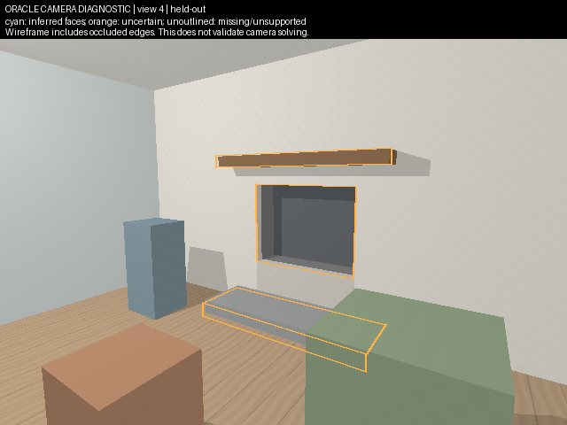
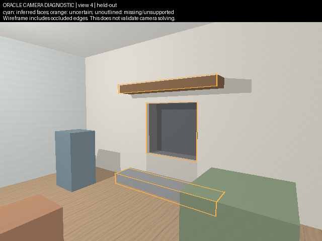

# M5 structural fitting: outcome and operating evidence

**Decision 3: stop automatic one-width room reconstruction and use a measured parametric workflow.** The prototype runs end to end and produces useful local feature sketches with explicit image assistance. It does not produce a useful architectural room proposal at the declared completeness gate. This is a decision about this bounded method and these synthetic fixtures, not a proof that every structural reconstruction method fails.

## What runs

The normal Node CLI now supports `structure`. It launches the existing CPU Python environment, saves inferred structural evidence, estimated cameras, diagnostics, an open OBJ, a checked SceneSpec and separate fitting/projection integrity receipts. Three coherent modes share one implementation: automatic, image-assisted with normals, and the identical assisted route without neural terms. No paid execution, new model family, dependencies, renderer, product UI, deployment or client modification occurred.

From the repository root:

```powershell
node engine/cli.mjs structure --input .image-blaster/structure-v1/input --lane assisted --out .image-blaster/structure-v1/assisted
node engine/cli.mjs validate --scene .image-blaster/structure-v1/assisted/scene-spec.json
node benchmarks/structure/inspect.mjs
```

The last command opens a loopback server at `http://127.0.0.1:4318/`; follow its URL. The inspection page uses the existing Three.js OBJLoader and OrbitControls. It displays saved meshes, actual fit diagnostics, uncertainty and all four diagnostic overlays. It adds no new renderer and does not change the existing application. To inspect the supplemental result, pass `.image-blaster/structure-v1-supplemental` and another port, such as `4319`.

Visual thesis: a quiet, dark inspection workspace with geometry as the main evidence. Content: saved structure, uncertainty, then source/held-out overlays. Interaction: orbit/zoom, lane selection, wireframe and reset; no decorative motion. Parent browser inspection verified mesh loading, all three lane selections, wireframe/reset and no console errors. The independent reviewer also inspected actual OBJ coordinates and original/supplemental overlay images.

## Frozen inputs, isolation and assumptions

The protocol and first image annotations were committed as `c38a098` before any fit score. The final fitter SHA256 is `0610fe22b14117fbcf48d8ac837baf77657653fe939fe6706706079c0a7bdb7d`; it remained unchanged across both fixtures. The [frozen protocol](STRUCTURAL-EXPERIMENT-V1.md) and [compact receipt](geometry-results/structure-v1/result-v1.json) record settings and hashes.

Only views 1–3 enter fitting or annotation. Original RGBs and independent MoGe M1 normals/masks were staged with verified source/artifact hashes; no jointly inferred DA3 data was used. Neural depth, point positions and intrinsics are not consumed. The sole metric input is **1.20 m across the opening mouth between the jambs in the wall plane**. Its new image endpoints are independently selected; original evaluation-only back-panel anchor pixels were not reused. Synthetic input is user-specified, never field-measured.

An isolated annotator received only the permitted RGBs and semantic naming rules, with no truth, numerical dimensions, neural output or view 4. Original assistance: 46 points (15/16/15), approximately 300 seconds. Supplemental: 47 points (16/16/15), approximately 180 seconds. Both use a 72-point ceiling and reported 2–3 pixel uncertainty. Automatic sees only a physically separate six-endpoint file. No manual assistance was revised after scoring.

The fixed hypotheses are planar rectangular Manhattan geometry, level floor axes, centered principal points, square pixels and zero distortion. Per-view focal lengths and poses are fitted, not supplied. Opening width fixes scale; mouth midpoint and declared axes fix the gauge. Normal directions constrain rotation only, with axial sign ambiguity. They do not locate planes. Soft-L1, fixed bounds, three starts, two 1-pixel perturbations and two 1% width perturbations were frozen before fitting. All lanes share initialization; the ablation never reads neural arrays or their manifest.

The fitter runs from an input directory containing allowlisted inputs. Its CPython audit hook denies other file opens, directory enumeration, networking and subprocesses after initialization; analytical tests perform actual forbidden opens. Each real run records denied probes for view 4, truth and fixture source. This protects against accidental leakage by trusted code, not hostile native extensions or a malicious operating-system process.

The independent evaluator generated one supplemental fixture after the implementation/settings freeze, changing visible proportions, object placement, focal lengths and camera arrangement using the existing renderer. Only its first three RGBs received new local MoGe inference: three forwards, 18.47 seconds inference, 25.11 seconds worker total, about 1.86 GiB peak. The first fixture and all first fitting outputs remain preserved. The original fixture is development data; its fourth view is only held out from this fitter. Neither synthetic fixture establishes real-photo generalization.

## Comparison

Fit time below includes starts and perturbations, excluding prior MoGe inference. Coverage is the fraction of all architectural truth samples in view 4 within 5 cm of an exported physical patch, not selected inliers.

| Fixture / route | Input clicks | Fit RMSE px | Rank / parameters | CPU seconds | Physical patches | View 4 coverage |
| --- | ---: | ---: | ---: | ---: | ---: | ---: |
| Original automatic | 6 | 8.338 | 22/22, focal bound hit | 4.35 | 0 | 0% |
| Original assisted + normals | 46 | 0.878 | 37/38 | 4.02 | 3 | 3.464% |
| Original assisted, no neural | 46 | 0.877 | 37/38 | 1.42 | 3 | 3.455% |
| Supplemental automatic | 6 | 1.943 | 20/22, focal bound hit | 6.69 | 0 | 0% |
| Supplemental assisted + normals | 47 | 0.758 | 37/38 | 4.94 | 3 | 3.827% |
| Supplemental assisted, no neural | 47 | 0.755 | 37/38 | 1.49 | 3 | 3.832% |

Every run reports **underconstrained**. Automatic proposes an opening rectangle from RGB edge candidates, but cameras are unstable and no physical patches are supported. Its opening-height errors are 1.82 cm on the original and 31.62 cm on the supplemental fixture. A small pixel residual can coexist with poor metric geometry.

Independent dimensional errors below are centimetres; the supplied width is excluded. The full original entity table, including all unsupported furniture, remains in the receipt.

| Dimension | Original assisted | Original ablation | Supplemental assisted | Supplemental ablation |
| --- | ---: | ---: | ---: | ---: |
| Observed room width | 10.58 | 10.84 | 8.23 | 7.27 |
| Observed room height | 5.38 | 5.43 | 5.96 | 5.63 |
| Opening mouth height | 0.88 | 0.89 | 0.24 | 0.21 |
| Hearth width | 3.33 | 3.27 | 1.70 | 1.78 |
| Hearth height | 0.07 | 0.07 | 0.32 | 0.32 |
| Hearth depth | 3.34 | 3.44 | 0.33 | 0.41 |
| Mantel width | 4.36 | 4.30 | 1.32 | 1.30 |
| Mantel height | 0.10 | 0.10 | 0.28 | 0.28 |
| Room/recess/mantel hidden depth | unsupported | unsupported | unsupported | unsupported |
| All furniture dimensions | unsupported | unsupported | unsupported | unsupported |

Assisted named-point median/p95 errors are 4.17/5.89 cm original and 2.83/5.09 cm supplemental. These are local annotated-feature results, not whole-room accuracy. Neural hints provide no consistent material improvement in dimensions, stability or assistance burden over the ablation and cost additional runtime. The shared unsupported mantel back/depth direction remains unresolved in both lanes.

## Planes, coverage and missing geometry

The OBJ contains only hearth top/front and mantel front. It contains no wall or floor patch, no solid opening, no rear enclosure, no invented wall thickness and no hidden mantel depth. Room width/height estimates come from observed corner constraints, not exported room surfaces. The whole back-wall quad is deliberately omitted because it would incorrectly fill the aperture. Finite floor/adjoining boundaries are unsupported. This fails required architectural completeness rather than silently substituting a finished room.

Supported assisted hearth top/front offsets are -3.44/+2.60 cm on the original and -1.53/+1.84 cm on the supplemental. Mantel front offsets and every truth face's finite-extent errors are in the receipt. Supported patches have zero axial angle error because Manhattan alignment is imposed as a hypothesis; flatness and those zero angles are not independent reconstruction evidence. Signed polygon winding is recorded separately and is not a semantic outward-normal guarantee. The evaluator also scores omitted truth faces, so nearby patches cannot erase the wall/floor deficit.

Original assisted source-view architectural coverage is about 4–6%, with 3.464% on held-out view 4. Supplemental source-view coverage is 5.023/5.843/6.548%, with 3.827% on view 4. All furniture remains unsupported; omitting it is not an improvement in reconstruction. The receipt records missing semantics separately from geometric proximity and preserves observed spans and false visible proposal fractions.

Evaluation uses one documented rigid datum translation after scale is fixed. No scale refit, ICP, per-object alignment or saved-camera substitution occurs. Actual source-camera errors are reported separately: assisted center errors are 18.9–28.5 cm original and 8.9–9.9 cm supplemental. Oracle-camera overlays and depth/edge agreement are explicitly diagnostic. There is no independent view 4 camera estimate, so the independent held-out reprojection gate remains unavailable and cannot pass.





## Stability, provenance and verification

The receipt retains parameter ranges across all starts and pixel perturbations and both 1% width perturbations. Hidden mantel back position and depth have null canonical values; their arbitrary candidate decomposition remains only in diagnostics with `identifiable:false`. Multiplying the only width changes metric geometry accordingly, without adding accuracy evidence. Local covariance is unavailable when rank-deficient. Bound contacts and positive-depth tests are retained, not filtered out.

Real CLI verification replayed all six fits without refitting, validated reopened SceneSpecs, exported all six visualization manifests and refused every Benson technical export. Width and annotation changes created different fit keys; an unrelated evaluation sidecar did not. Corrupted neural bytes are rejected in neural lanes and do not affect ablation replay. Saved SceneSpec has a separate implementation/content identity and byte-integrity receipt, including effective source/license metadata. Original 28 tracked preservation targets (RGBs, canonical truth, historical receipts and selected raw model artifacts) passed SHA256 equality.

Current-run verification: 72 Node/Windows tests, 13 viewer tests, 25 DA3 worker tests, 14 MoGe worker tests, 22 original geometry tests, 17 new fitter tests and 13 structural evaluator tests; Python compilation, JS syntax, typecheck and production build passed. The existing Vite large-chunk warning remains. The native worker and old evaluator gates ran as the baseline; those files were unchanged. New fit/adapter/evaluator checks and final Node/build gates ran after implementation. Automated tests do not establish real-photo, customer or installation acceptance.

The separate adversarial reviewer inspected truth isolation, identifiability, assistance fairness, cache/provenance, OBJ and held-out images. Findings were repaired, including effective-constraint ownership, canonical projection identity, endpoint isolation, unsupported-axis handling and uncertainty display. Parent review additionally clarified semantic missingness versus merely touching a nearby patch. The final review found no remaining actionable defect within this bounded scope; reconstruction success remains explicitly unachieved.

Two evaluator/report repairs are disclosed without retuning: the first attempted score hit an empty eroded thin-face population and failed JSON serialization; scoring now includes all visible face samples. An additive report revision distinguishes absent semantic surfaces from incidental geometric contact, preserving the first numeric reports. Fitter code, settings, annotations and saved geometry did not change. Projection receipt fixes changed only canonical packaging, not the estimator.

No dependency was added. Existing Python 3.12.12, NumPy 2.2.6, SciPy 1.15.3, OpenCV 4.11.0, Pillow 11.2.1 and Three.js 0.180.0 were reused; existing licenses/notices remain applicable. Cached neural provenance retains exact model/source/runtime identities. All inferred geometry remains visual-only, even when constrained to the supplied width. No registered/manufacturer authority or installation approval is introduced.

The honest product direction is measurement-led room authoring, with photos supporting placement and visual context. Preserve this prototype as an inspectable feature-fitting experiment. It does not justify a real-photo reconstruction trial or another automatic model comparison without separate authorization.
